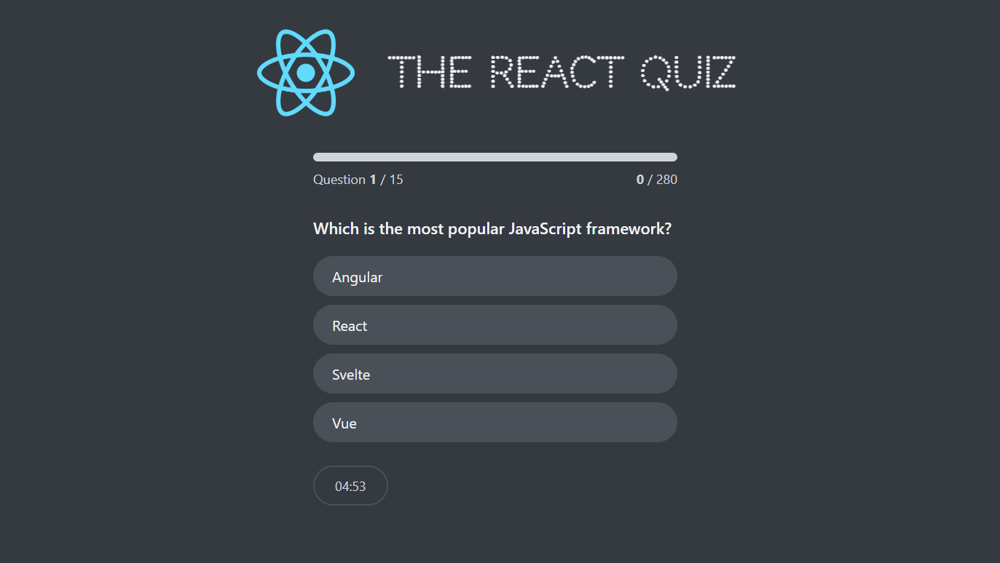

# React Quiz

>  This project leverages React.js, modular components, and state management with useReducer to create a smooth, engaging gameplay experience. It also integrates API calls for fetching quiz questions dynamically.
### Ajustes e melhorias

This project may be updated, below you can find possible addictions:

- [x] Timer based on number of questions.
- [x] Highscore state to save best results data.
- [ ] Allow the user to filter for the difficulty of questions.
- [ ] Upload the highscore of que quiz in the API as well.
- [ ] Store answers in an array for the user review their answers.
